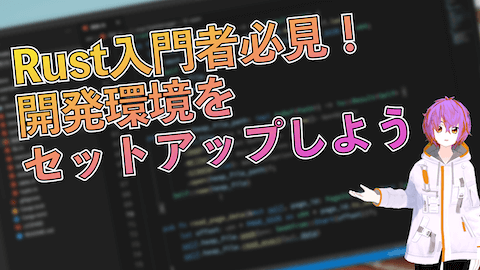

# relly

## relly とは

relly は RDBMS のしくみを学ぶための小さな RDBMS 実装です。

「WEB+DB PRESS Vol. 122『特集3 作って学ぶ RDBMS のしくみ』」の題材として開発されました。

## 環境構築

ビルドするには Rust のツールチェーンが必要です。未セットアップの場合は [Install Rust - Rust Programming Language](https://www.rust-lang.org/tools/install)  などを参考にしながらセットアップしてください。

入力補完などの便利な機能のセットアップについては、以下の動画で紹介しています。参考にしてください。

[Rust入門者必見！開発環境をセットアップしよう](https://www.youtube.com/watch?v=677kcyyPwJ4)
